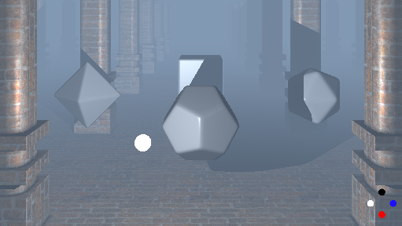

# g-matrix 홈페이지

이 저장소는 g-matrix의 개인 홈페이지입니다. WebGL, WebGPU, 인포그래픽 등 다양한 실험적 프로젝트와 자료를 한 곳에서 소개합니다.

## 주요 특징
- **WebGL & WebGPU 데모**: 직접 구현한 그래픽 데모와 실험 코드
- **인포그래픽/자료**: BitNet 등 최신 AI/그래픽 관련 인포그래픽
- **심플하고 현대적인 디자인**: 반응형, 카드 스타일, 자동 링크 생성
- **개인 소개 및 다양한 실험**: 포트폴리오뿐 아니라 개인 홈페이지로 활용

## hillstate(WebGL) 데모 스크린샷

## 파일 구성
- `index.html` : 홈페이지 메인(모든 프로젝트 링크, 소개)
- `BitNet.html` : BitNet 1.58비트 LLM 인포그래픽
- `hillstate.html`, `hillstate2018.html` : WebGL 기반 3D 데모
- `webgl3.html` : WebGL 튜토리얼 예제
- `WebGPU.html`, `WebGPU2.html` : WebGPU 기반 그래픽 데모
- `sonar_simulator.html` : 소나 시뮬레이터(가상 환경에서 소나 신호 시각화)
- 기타 이미지, 사운드, JS 파일 등

## 사용 방법
1. 이 저장소를 클론하거나 다운로드합니다.
2. `index.html`을 브라우저에서 열면 모든 프로젝트와 자료를 한눈에 볼 수 있습니다.

---

문의: [g-matrix](mailto:idgmatrix@gmail.com)
